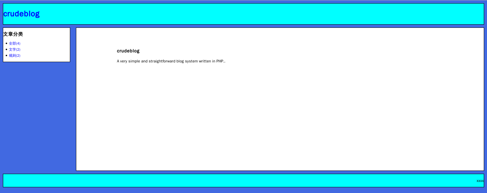

# Description
A simple blog system written in raw PHP, just for learning use.

# Stautus
## Done
* single article and its comment display
* article list display
    * whole list
    * list by category
* categories are always display in sidepanel
* anoymous comment to a article
* admin user log in, log out
* write and add article, with category
* edit and update previous article
* delte article
* markdown convert(store in markdown, convert to html when dispaly)

## Undone

* head meta imfomations display
* export article as text
* batch operation with article
* delete comment
* add keywords and description to article
* add picture function article 
* change query string to ascii

# Program structure

TODO: explain the files.

    css
        1.css
    include
        footer.php
        header_admin.php
        header.php
        side_admin.php
        side.php
        site_define.php
        sql_connect.php
        sql_result_array.php
    admin
        add.php
        article_list.php
        article.php
        comment.php
        delete_confirm.php
        delete.php
        index.php
        login.php
        logout.php
        update.php
        write.php
    article_list.php
    article.php
    comment.php
    index.php

# Quick start
## Put files
Put all files in 'htdocs' directory in your website root document directory.

## Create database
See file 'DATABASE.sql' in git root directory and create a database with any name.

## Set variables
Edit file 'include/site_define.php'

    // Database
    define('HOST', '');
    define('USER', '');
    define('PASSWORD', '');
    define('DB', '');

    // Blog name, default is 'crudeblog'
    define('BLOGNAME', 'crudeblog');

    // User name and password
    define('ADMIN', '');
    define('ADMIN_PASS', '');

## Use
Use web browser visit your site, the index page for guset is display.
